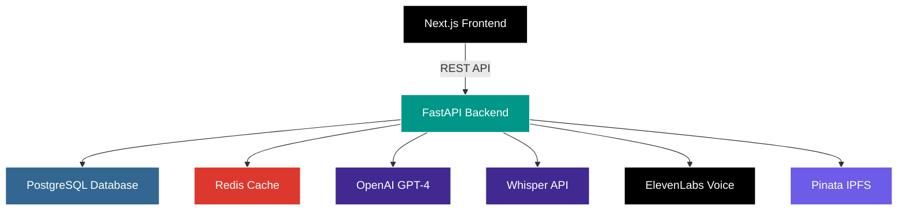

<div align="center">

# MemoryVault

### Preserve Life Stories for Future Generations

<p align="center">
  
  
  
  
</p>

<p align="center">
  
  
  
</p>

<p align="center">
  <strong>An AI-powered platform that captures and preserves the precious memories of our elders</strong>
</p>

<p align="center">
  <a href="#-features">Features</a> •
  <a href="#-quick-start">Quick Start</a> •
  <a href="#-tech-stack">Tech Stack</a> •
  <a href="#-documentation">Documentation</a> •
  <a href="#-contributing">Contributing</a>
</p>

</div>

---

## The Problem

<table>
<tr>
<td width="70%">

**70% of family stories are lost within two generations.**

Every day, countless stories of love, struggle, triumph, and wisdom disappear forever. Grandparents pass away with their memories unrecorded. Parents forget to ask the right questions. Children grow up never knowing their heritage.

MemoryVault solves this by creating an **empathetic AI interviewer** that helps families capture and preserve life stories in their elders' own voices, ensuring these precious memories live on forever.

</td>
<td width="30%">

```
📊 Statistics
━━━━━━━━━━━━━━━
70% Stories Lost
2  Generations
∞  Memories Gone
```

</td>
</tr>
</table>

---

## Features

<div align="center">

### Current

| Feature | Description |
|---------|-------------|
| **AI Interviewer** | Empathetic AI that asks thoughtful questions and adapts to responses |
| **Voice Recording** | High-quality audio capture with automatic transcription |
| **Memory Enrichment** | AI-powered tagging, categorization, and historical context |
| **IPFS Storage** | Permanent, decentralized storage - memories can never be deleted |
| **Family Dashboard** | Beautiful interface to explore and share memories |

### Coming Soon

```
┌─────────────────────────────────────────────────────┐
│  🎙️  Voice Cloning      │  Create AI voice of elders │
│  📅  Timeline View       │  Interactive life journey  │
│  🔍  Smart Search        │  Find memories instantly   │
│  📚  Memory Books        │  Export as PDF/audio book  │
│  👨‍👩‍👧‍👦  Collaboration      │  Multi-family sharing      │
└─────────────────────────────────────────────────────┘
```

</div>

---

## Architecture

<div align="center">



</div>

### How It Works

```
1. 👤 User starts AI interview    →    AI asks thoughtful questions
2. 🎤 Elder shares their story    →    Audio recorded & transcribed
3. 🤖 AI enriches the memory     →    Tags, context, connections
4. 💾 Stored on IPFS forever     →    Decentralized, permanent
5. 👨‍👩‍👧‍👦 Family explores timeline  →    Beautiful, searchable interface
```

---

## Tech Stack

<table>
<tr>
<td width="33%" align="center">

### Frontend


- Server-side rendering
- Type-safe code
- shadcn/ui components
- Zustand state management

</td>
<td width="33%" align="center">

### Backend


- Async/await architecture
- SQLAlchemy ORM
- Celery background tasks
- Auto-generated API docs

</td>
<td width="33%" align="center">

### AI & Storage


- GPT-4 for conversations
- Whisper for transcription
- ElevenLabs voice cloning
- Permanent IPFS storage

</td>
</tr>
</table>

---

## Quick Start

### Prerequisites

```bash
✓ Node.js >= 18
✓ Python >= 3.11
✓ pnpm >= 8
✓ Docker & Docker Compose
```

### Installation

```bash
# 1. Clone the repository
git clone https://github.com/Sant0-9/MemVault.git
cd MemVault

# 2. Install dependencies
pnpm install
cd packages/backend && pip install -r requirements/dev.txt

# 3. Set up environment variables
cp packages/backend/.env.example packages/backend/.env
cp packages/frontend/.env.local.example packages/frontend/.env.local

# 4. Start development services
docker-compose up -d

# 5. Run database migrations
cd packages/backend && alembic upgrade head

# 6. Start the application
pnpm dev
```

### Access the Application

| Service | URL | Description |
|---------|-----|-------------|
| Frontend | http://localhost:3000 | Main application interface |
| Backend API | http://localhost:8000 | REST API server |
| API Docs | http://localhost:8000/api/v1/docs | Interactive API documentation |

---

## Project Structure

```
MemVault/
│
├── packages/
│   ├── backend/              # FastAPI Python backend
│   │   ├── app/
│   │   │   ├── api/         # REST API endpoints
│   │   │   ├── core/        # Configuration & security
│   │   │   ├── db/          # Database models & migrations
│   │   │   ├── services/    # Business logic & AI services
│   │   │   └── schemas/     # Request/response models
│   │   ├── alembic/         # Database migrations
│   │   └── tests/           # Backend tests
│   │
│   └── frontend/            # Next.js TypeScript frontend
│       ├── src/
│       │   ├── app/         # Next.js app router pages
│       │   ├── components/  # React components
│       │   ├── lib/         # Utilities & API client
│       │   └── types/       # TypeScript definitions
│       └── tests/           # Frontend tests
│
├── shared/                  # Shared TypeScript types & utilities
│   ├── types/              # Common type definitions
│   ├── constants/          # Shared constants
│   └── utils/              # Utility functions
│
├── docs/                   # Documentation
│   ├── ARCHITECTURE.md     # System architecture
│   ├── API.md             # API documentation
│   ├── DEVELOPMENT.md     # Development guide
│   └── CONTRIBUTING.md    # Contribution guidelines
│
└── .github/               # GitHub Actions CI/CD
    └── workflows/
```

---

## Documentation

<div align="center">

| Document | Description |
|----------|-------------|
| [Architecture Guide](docs/ARCHITECTURE.md) | System design and technical decisions |
| [API Documentation](docs/API.md) | Complete API reference with examples |
| [Development Guide](docs/DEVELOPMENT.md) | Setup and development workflow |
| [Contributing Guide](docs/CONTRIBUTING.md) | How to contribute to the project |

</div>

---

## Development Workflow


### Commands

```bash
# Run tests
pnpm test

# Lint code
pnpm lint

# Format code
pnpm format

# Build for production
pnpm build
```

---

## Why MemoryVault?

<table>
<tr>
<td width="50%">

### For Families
- Never lose precious memories
- Easy-to-use AI interviewer
- Beautiful timeline of life events
- Share across generations
- Export as books or audio

</td>
<td width="50%">

### For Developers
- Production-grade architecture
- Modern tech stack
- Comprehensive documentation
- Full test coverage
- CI/CD pipeline
- Open source

</td>
</tr>
</table>

---

## Contributing

We welcome contributions! Whether it's:

- Reporting bugs
- Suggesting features
- Writing documentation
- Submitting code

Please read our [Contributing Guide](docs/CONTRIBUTING.md) to get started.

---

## License

This project is licensed under the MIT License - see the [LICENSE](LICENSE) file for details.

---

## Acknowledgments

Built with love for families everywhere who want to preserve their stories.

<div align="center">

**Made with ❤️ by the MemoryVault Team**

<p>
  <a href="https://github.com/Sant0-9/MemVault/stargazers">⭐ Star us on GitHub</a> •
  <a href="https://github.com/Sant0-9/MemVault/issues">🐛 Report Bug</a> •
  <a href="https://github.com/Sant0-9/MemVault/issues">💡 Request Feature</a>
</p>

</div>
